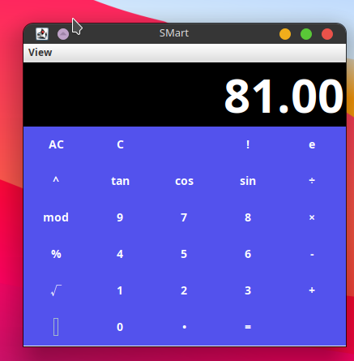

# Calculator Using Java(swing)

simple calculator using java to calculate simple and scientific expression width binary, octal, hexadecimal convertor.

## Authors

- [@ojpro](https://www.github.com/ojpro)

## Features

- Multi Theme Switcher
- Live COnvertor
- Multi Funtionalities
- Simple to Use

## License

[MIT](https://choosealicense.com/licenses/mit/)

## Screenshots

## Support

For support, email contact@ojpro.me.

